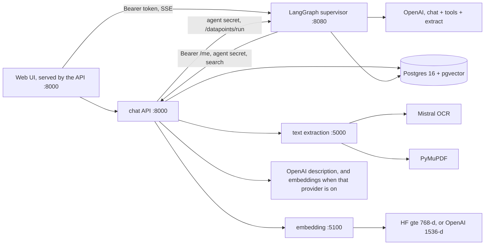
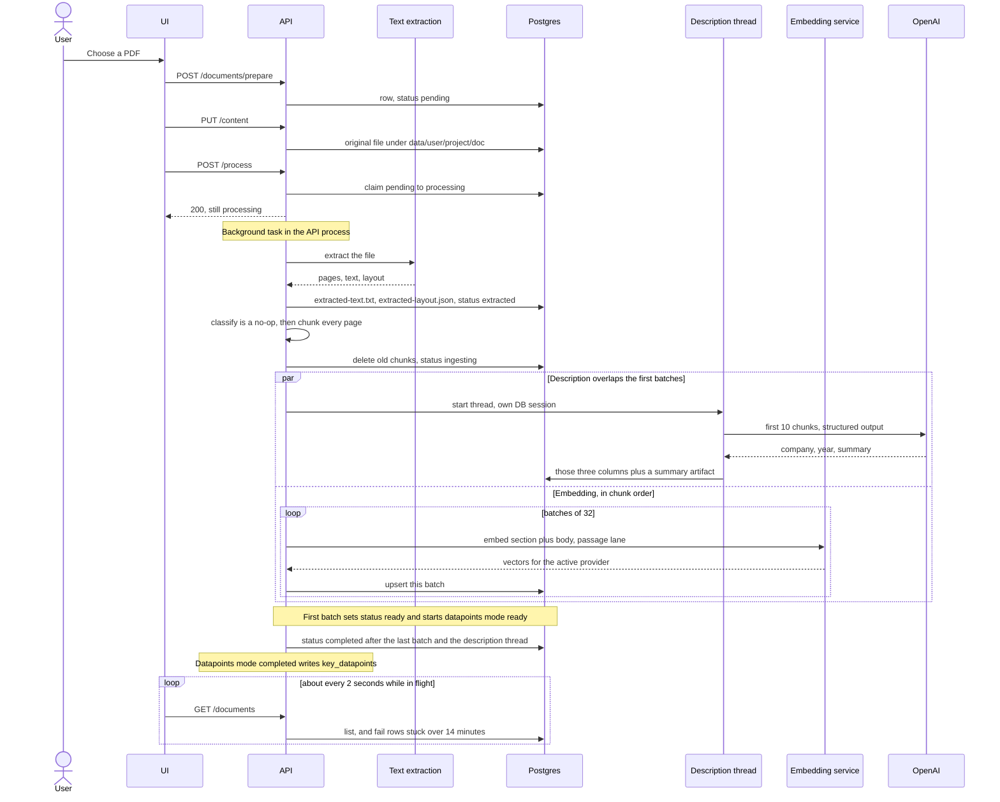
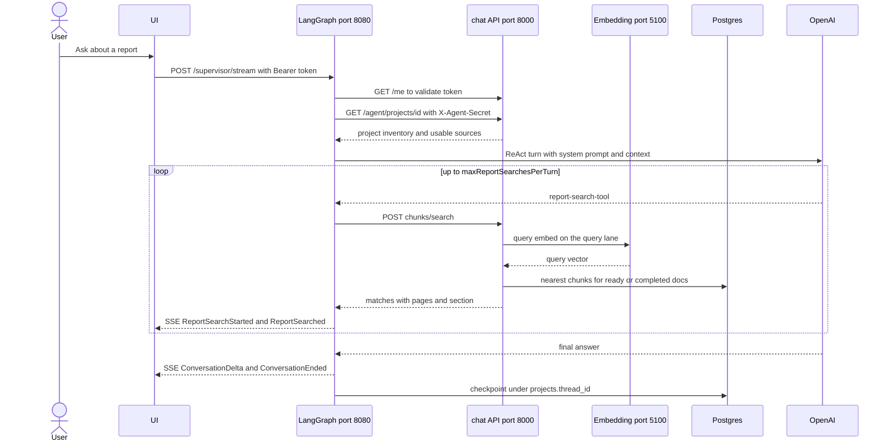
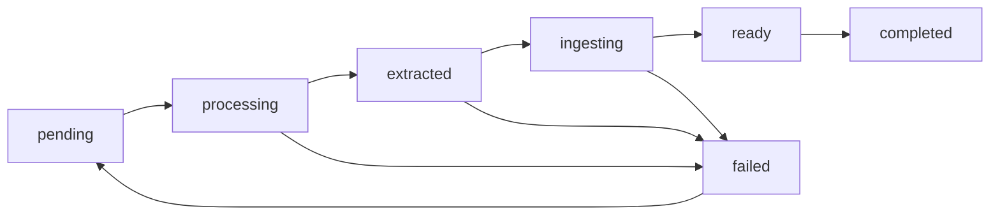
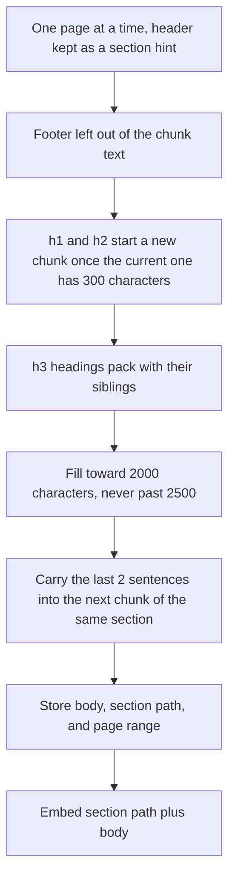

# Annual Report Analyst — system overview

Author: [Anustup Das](https://github.com/anustupdas).

This is a local retrieval + chat system for annual-report PDFs. You upload a
report into a project, the pipeline turns it into searchable chunks, and a
question can be asked as soon as the first batch of those chunks is stored. The
analyst chat is a live LangGraph ReAct supervisor: it searches those chunks and
answers with page citations over SSE.

## Design

The split is by who owns the work.

- The API owns users, projects, files, ingest, and the database. It is the only
  writer of `documents` and of chunk rows.
- Text extraction and embedding are separate processes so a PDF parser or a
  local model does not live inside the request process.
- LangGraph is a separate process so the agent loop and SSE do not share the
  API’s ingest threads. The browser talks to it directly. The API calls it
  only for key datapoints.
- There is one supervisor, not a second agent. Datapoints reuse that graph
  on a throwaway thread, then a structured extract writes JSON. The API merges
  that JSON onto the document. LangGraph does not write `key_datapoints`.
- Chunk text and vectors are separate. Two embedding providers can exist at
  once; search uses the table for the provider configured at startup.
- Prompts ship in the repo. Langfuse is optional: with keys it traces and can
  replace those prompts; without keys the local files are what runs.
- There is no queue. Ingest is a background task in the API process. A restart
  of that process drops an ingest that has not finished.
- Search only returns chunks from documents that are `ready` or `completed`.

Options for OCR, embeddings, and Langfuse are in
[service options](service-options.md).

## How it is put together

Five processes, all on this machine:

The API owns users, projects, documents, and the ingest job. Text extraction and
embedding are separate processes so a heavy model does not live inside the
request process. LangGraph is a separate FastAPI service so the chat agent,
tool loop, and SSE streaming do not share the API’s ingest threads. Postgres
holds application rows, chunk text, embedding vectors, and LangGraph checkpoints in
the same database.

There is no queue: `POST .../process` claims the document and FastAPI runs
`run_document_ingest` as a background task inside the API process. Chat does
not go through that path — the browser calls LangGraph directly.

Secrets live in `.env` (`OPENAI_API_KEY`, `MISTRAL_API_KEY`, database
password, agent secrets, Langfuse keys). Ports, model name, chunk sizes,
timeouts, and `supervisor.maxReportSearchesPerTurn` live in each service’s
`configs/staging/config.yml`. A real process environment variable still
overrides the YAML. Docker reads one root `.env` and also honors
`TEXT_EXTRACTION_USE_OCR` and `EMBEDDING_PROVIDER` from that file. See
[Start with Docker](#start-with-docker). Each service's choices and the
combinations that run are in [service options](service-options.md).

## Web UI

The chat API serves `apps/web` at `/` and `/project/{id}`. `/` is the sign-in
page until a session exists, then the report-projects home. `/project/{id}` is
the three-pane workspace.

**Public documents only.** The sign-in page and the signed-in home both show
the same note: do not upload personal documents. Text from uploaded files can
be sent to an external LLM, and no GDPR guardrail is in place yet.

**Light and dark surfaces.** Light mode uses a gray page (`#f0f2f5`), white
cards, and a blue accent (`#1877f2`). Dark mode sets `theme-dark` on `html`.
The Dark mode / Light mode button on the sign-in page, the home top bar, and
the workspace top bar stores `light` or `dark` in `localStorage` as
`report_rag_theme`. With nothing stored, the page follows
`prefers-color-scheme`. A short script in `index.html` applies the class
before the first paint.

## Decisions that shape the pipeline

**The long ingest work stays synchronous.** Extraction, chunking, and embedding
use blocking HTTP and a normal SQLAlchemy session. FastAPI already runs those
handlers on a worker thread, so the event loop stays free for the UI poll. The
upload route is a normal `def` for the same reason: reading the file and writing
disk used to sit on the event loop and stall every other request.

**One extra thread, and only for the description.** Once the chunks exist, a
second thread calls the LLM with the first 10 chunks and writes `company_name`,
`report_year`, and `summary`. It has its own database session and never touches
`status`. The main thread keeps embedding. A failure in the description is
logged and the report still completes.

**Embeddings are saved in order, 32 at a time.** Chunk text lives in
`document_chunks`; vectors live in a provider table selected by
`embedding.provider` (`document_chunk_embeddings_hf` for local gte / 768-d, or
`document_chunk_embeddings_openai` for OpenAI / 1536-d). The embedding service
still receives ingest batches sequentially from the API so document order is
preserved and the front of the report becomes searchable after one round trip.
Local staging uses OpenAI `text-embedding-3-small`. Set `embedding.provider`
to `huggingface` to use the local model instead. That path keeps **two
dedicated encode lanes** (query vs passage). OpenAI calls
`POST /api/v1/embeddings/openai` on the same service and does not use those lanes.

**`ready` means searchable, `completed` means finished.** Search only returns
chunks whose document is `ready` or `completed`. A partial index is usable.
Chunks from a `failed` document are hidden until a reprocess deletes them and
writes a new set.

**The same chunker serves both extractors.** Mistral, when
`textExtraction.useOcr` is true, returns markdown, HTML tables turned into
markdown, separate headers and footers, images, and page blocks. PyMuPDF returns
plain text and the chunker infers the running header. After that, chunk sizes,
overlap, and what gets embedded are the same.

**Chat is ReAct with a hard search budget.** The supervisor calls
`report-search-tool`, which hits the API’s agent search endpoint. At most
`supervisor.maxReportSearchesPerTurn` (default 5) tool calls are allowed per
user message; the system prompt also steers toward 1–2 focused searches.
History is checkpointed under the project’s `thread_id`. Tool JSON is not
replayed into the next turn’s model context.

## What happens on an upload

`prepare` creates the row and the folder. `content` is allowed only while the
row is `pending` or `failed`. `process` is an atomic claim: a second click gets
a 409 because the status is no longer claimable.

If extraction returns empty text, chunking produces nothing, or a batch comes
back with the wrong number of vectors, the row becomes `failed` immediately and
the error is stored. Chunks already written stay in the table, and search
ignores them because the status is `failed`. The description thread is joined
before that failure is recorded, so it cannot write after the session has moved
on.

## What happens on a chat question

The UI loads older turns from `GET /supervisor/history` (newest page first).
Token regenerate keeps the previous Bearer hash valid until the next regenerate
so an open chat session survives a regenerate from another tab.

## Status

| Status | What just finished | How long it lasted on ABN AMRO |
|---|---|---|
| `pending` | Row exists, file may already be uploaded | until you press process |
| `processing` | Claimed; Mistral or PyMuPDF is reading the file | ~29 seconds |
| `extracted` | Text and layout are on disk; chunking runs | under a second |
| `ingesting` | Old chunks deleted; first batch of 32 is embedding | ~11 seconds |
| `ready` | First 32 chunks are searchable; the rest are still embedding | ~12 minutes |
| `completed` | Every chunk is stored and the description thread has finished | stays there |
| `failed` | The pipeline threw, or a watched status sat still for 14 minutes | until you upload again or reprocess |

The UI polls while the status is `pending`, `processing`, `extracted`,
`ingesting`, or `ready`. Each poll also runs the stale check: a row still in
`processing`, `extracted`, or `ingesting` whose `updated_at` is older than 14
minutes is marked `failed`. `ready` is outside that check, because the long
embed happens there and the document row is not touched again until
`completed`. A normal Apple or ABN AMRO run never gets near 14 minutes in the
three watched statuses.

Re-uploading a failed document sets it back to `pending`. Reprocessing deletes
that document’s chunks before the new batches are inserted.

## Chunking

The rule is: keep a section together, break on a paragraph before a sentence,
and break on a word only when a single sentence is too long. Target size is
2000 characters, hard cap 2500, and the next chunk in the same section repeats
the last 2 sentences.

A page header such as `Risk, funding & capital › Key risk developments` becomes
the section label. That label is stored on the chunk and prepended to the text
sent to the embedding model, so a question about capital can match a chunk whose
body never repeats the section name. The footer (page number, report title) is
dropped from the chunk. It remains in `extracted-layout.json` with the images
and blocks.

In-page headings stay inside the chunk body. A running header that appears on
most pages is treated as furniture and is not used as the section. Major
headings (`#`, `##`) force a new chunk. Smaller headings stay packed with the
paragraphs under them.

Both extractors feed this. Mistral already separates the header, so it is passed
in as the hint. PyMuPDF text has the header inside the page, and the chunker
detects lines that repeat at the top.

## What is stored

| Place | Contents |
|---|---|
| `data/{user}/{project}/{doc}/original.pdf` | The upload |
| `extracted-text.txt` | Search text: headers removed from the body, tables inlined as markdown |
| `extracted-layout.json` plus `images/` | Pages, headers, footers, tables, image files, blocks |
| `summary` artifact | The LLM description, when it succeeds |
| `documents` | Status, error, company, year, summary, `key_datapoints` JSON. `doc_type` stays empty |
| `document_chunks` | Body, section, page range (no vector column) |
| `document_chunk_embeddings_hf` | 768-d gte vectors keyed by `chunk_id` |
| `document_chunk_embeddings_openai` | 1536-d OpenAI vectors keyed by `chunk_id` |
| LangGraph checkpoints | Chat transcript for `projects.thread_id` (tool payloads stripped from model replay) |

Search embeds the question with the configured provider (`huggingface` uses
`input_type=query`; OpenAI has no prefixes), then takes the nearest chunks by
cosine distance inside that user and project **and the active provider table**.
Default limit is 8. Hits include the section and the page range so the
supervisor can cite them.

Switching `embedding.provider` in config does not convert existing vectors —
re-process documents (or dual-write later) so the active table is filled.

The description model is `gpt-6-luna`, called with structured output for company
name, report year, and a 3–5 sentence description of the document. The prompt is
a Langfuse-shaped fallback in the repo. The year it asks for is the year the
report covers, which is the fiscal year-end year when those differ. It reads
only the opening chunks.

The supervisor prompts are `supervisor_agent/supervisor/main` (chat) and
`supervisor_agent/supervisor/detail-extractor` (datapoints search) in Langfuse,
with local fallbacks under
`apps/langgraph-server/src/langgraph_server/prompt/fallback_prompts/`.
Structured fill uses `supervisor_agent/extractor/main` with `max_output_tokens`
8000, so reasoning tokens still leave room for the KeyDatapoints JSON.

## What is still a stand-in

The document-type classifier raises `NotImplementedError` on purpose, so
`doc_type` is never set. The UI shows “Detecting…” for that field during `ready`
and “Not detected” once the report is `completed`.

**FTE count and sustainability goals** use the **same supervisor graph** and
`report-search-tool`, not a second ReAct agent. chat-api calls
`POST /datapoints/run` with `X-Agent-Secret`. That endpoint runs the supervisor
with `mode=datapoints` and prompt branch `detail-extractor` on a **dedicated
thread** (so project chat history stays clean), mutes all custom SSE, then runs
the structured `supervisor_agent/extractor` step and returns JSON. chat-api
merges into `documents.key_datapoints`.

| Trigger | job `mode` | Supervisor prompt |
|---|---|---|
| First embed batch → `ready` | `ready` | `detail-extractor` |
| Last batch → `completed` | `completed` | `detail-extractor` |
| UI Refresh / backfill | `refresh` | `detail-extractor` |

Interactive chat uses `POST /supervisor/stream` with `mode=chat` and prompt
`main` (streaming Q&A only — no Key datapoints write).

**Model context stays bounded.** Chat turns keep a compressed
`[COMPRESSED_CONTEXT]` note plus recent messages (summarize at ~50 messages /
~80k tokens; keep last 20 after each compress). Tool JSON from
`report-search-tool` is available on the turn it runs, then stripped before the
next model call so history does not accumulate search payloads.

Live chat: the browser talks to LangGraph at `langgraph.url`
(`http://localhost:8080`), and LangGraph calls the API with the user Bearer
token plus `X-Agent-Secret` for inventory and search.

One limit follows from the process layout, and only when embeddings are
Hugging Face. Two reports processed at the same time share that service’s
passage encode lane, so each ingest batch gets slower and the logs interleave.
Query embeds stay on their own lane. OpenAI embeddings do not use those lanes.
The chunks stay separated by `document_id` either way. Restarting the API kills
an ingest that has not finished, because the job is a background task in that
process. Restarting LangGraph drops in-flight SSE streams; checkpoints already
written remain.

## Start with Docker

Docker with Compose is enough. The root `.env` is the only file the containers
read.

1. `cp .env.example .env` and set `OPENAI_API_KEY`. Chat needs that key even
   when embeddings are Hugging Face.
2. `docker compose --env-file .env build` builds text extraction, embedding,
   the API (with the UI), and LangGraph.
3. `docker compose --env-file .env up` starts those images plus Postgres. A
   one-shot migrate container applies `db/migrations` after Postgres is
   healthy. The UI is http://localhost:8000/.

Stop with `docker compose --env-file .env down`. The database volume stays.

`DATA_DIR` (default `./data`) is the host folder mounted at `/data` for the
API and text extraction. `TEXT_EXTRACTION_USE_OCR=false` keeps PyMuPDF; `true`
turns on Mistral OCR and requires `MISTRAL_API_KEY`. `EMBEDDING_PROVIDER` is
`openai` or `huggingface`. The API entrypoint sets the matching model and
dimension at start (`text-embedding-3-small` / 1536, or `gte-multilingual-base`
/ 768). The embedding container loads the local model only for `huggingface`.
Switching provider does not rewrite vectors already stored. `AGENT_SECRET`
defaults to the dev value when omitted. Service hostnames
(`http://embedding:5100`, `postgres`, and so on) are set by Compose, not by
that file. `langgraph.url` stays `http://localhost:8080` for the browser.
Datapoints use `LANGGRAPH_INTERNAL_URL=http://langgraph:8080`.

## Ports

| Process | Port | Role |
|---|---|---|
| chat API (+ static UI) | 8000 | Users, projects, ingest, vector search, agent endpoints |
| text extraction | 5000 | PDF → text / layout |
| embedding | 5100 | Query + passage encode lanes |
| LangGraph supervisor | 8080 | ReAct chat, SSE, history, checkpoints, datapoints extract |
| Postgres | 5432 | Rows, pgvector, LangGraph checkpoints |

Text extraction and embedding also serve Prometheus at `GET /metrics` on their
own ports (5000 and 5100) when `prometheus.enabled` is true. Grafana scrapes
those paths. There is no separate metrics port.
